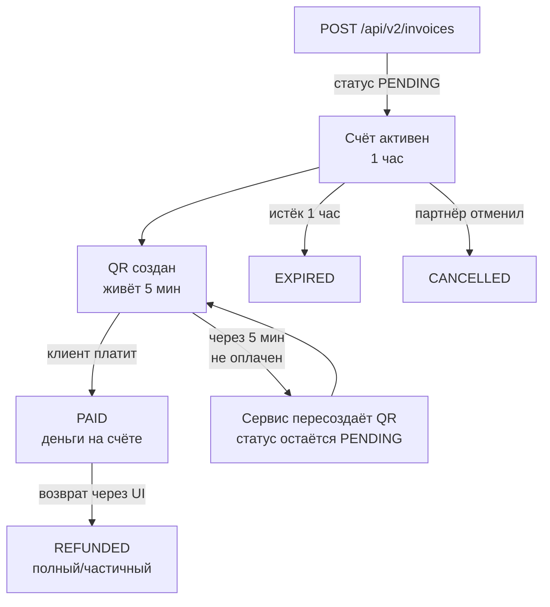

## Главное в одном предложении

**Внутренний счёт Love&Pay живёт 1 час**, СБП-QR от банка живёт **5 минут**, поэтому в течение часа мы автоматически пересоздаём QR каждые 5 минут — клиент всегда видит свежий код, а вам ничего делать не нужно.

## Полная схема



## Статусы счёта

| Статус | Описание | Можно создавать возврат? |
|---|---|---|
| **PENDING** | Создан, ожидает оплаты, QR активен | — |
| **PAID** | Оплачен клиентом, деньги на балансе | ✅ Да |
| **EXPIRED** | Истёк час, оплата невозможна | — |
| **CANCELLED** | Отменён партнёром через UI/API | — |
| **REFUNDED** | Полностью возвращён клиенту | — (уже возвращён) |

## QR-коды: почему пересоздаются

Любой банк-участник СБП выдаёт **одноразовый QR с TTL 5 минут**. Это требование НСПК (Национальной системы платёжных карт) — для безопасности.

Чтобы клиент мог открыть счёт спустя 10-30 минут и всё равно увидеть валидный QR, **наш бэк сам обращается к банку и просит новый QR каждые 5 минут**, пока внутренний счёт активен (1 час).

### Что это значит для вас

| Где | Что отображается |
|---|---|
| **`invoice.qrCodeBase64`** в API | Текущий валидный QR (PNG base64) на момент запроса |
| **Платёжная страница** `/pay/INV-XXX` | Авто-обновление QR каждые 5 минут без перезагрузки |
| **POS-кабинет** партнёра | Реал-тайм обновление в UI |

<Warning>
Если вы **кешируете** `qrCodeBase64` у себя — кеш живёт не дольше 5 минут. Лучше всегда **передавайте клиенту ссылку `paymentLink`** — она рендерит свежий QR при каждом открытии.
</Warning>

## Жизнь счёта = 1 час (по умолчанию)

После создания счёт активен ровно `expiresAt = createdAt + 1 час`. По истечении:

- Статус автоматически меняется на `EXPIRED`
- Любая попытка оплаты возвращает ошибку клиенту
- Срабатывает webhook `invoice.expired` (если настроен)
- Счёт остаётся в истории навсегда (для отчётности)

## Что делать, если клиент опоздал

1. **Создайте новый счёт** через API или UI — это занимает миллисекунду.
2. Если есть customer-flow с retention, используйте `customerEmail` / `customerPhone` при создании — сможете находить клиентские повторы по этим полям.

## Возвраты

После статуса `PAID` партнёр может оформить возврат через [Возвраты](https://loveandpay.io/dashboard/refunds):

- **Полный** — вся сумма счёта обратно клиенту.
- **Частичный** — любая часть. Несколько частичных возвратов на один счёт допустимы пока их сумма ≤ исходной.

<Note>
**Сроки**: 1–5 рабочих дней — зависит от банка клиента.
**Комиссия**: процент удержания задан в тарифе партнёра (поле `refundFeePercent`).
</Note>

После возврата:
- Статус счёта → `REFUNDED` (для полного), при частичных остаётся `PAID` + появляется запись о возврате
- Отдельного webhook о возврате нет — отслеживайте смену статуса счёта (`GET /invoices/{id}`)

## Метаданные счёта

При создании можно передать `metadata` (JSON). Это поле сохраняется и возвращается в каждом ответе и вебхуке — удобно для связки с вашим внутренним order id, корзиной, клиентом.

```json
{
  "amount": 250000,
  "description": "Заказ #12345",
  "metadata": {
    "orderId": "12345",
    "shopId": "moscow-1",
    "items": [{"sku": "A001", "qty": 2}]
  }
}
```

## Реалтайм отслеживание статуса

Три способа узнать что счёт оплачен:

| Способ | Latency | Когда использовать |
|---|---|---|
| **Webhook** | 1–3 сек | Production — самый надёжный |
| **GET /api/v2/invoices/{id}** | по запросу | Резерв на случай пропущенного вебхука |
| **POS-UI polling** | 3 сек | Только в кабинете партнёра — там это уже встроено |

[Настроить вебхук →](/guides/webhooks)

## QuickReference

| Параметр | Значение |
|---|---|
| TTL внутреннего счёта | **1 час** |
| TTL СБП-QR от банка | **5 минут** |
| Период автопересоздания QR | **каждые 5 минут** |
| Минимальная сумма счёта | **10 ₽** (1000 копеек) |
| Максимальная сумма | Зависит от лимитов вашего терминала |
| События webhook'а | `invoice.paid`, `invoice.expired`, `invoice.cancelled` (+ `invoice.created`, `invoice.updated`, `transaction.*`, `payment.*`, `kyc.*`) |
