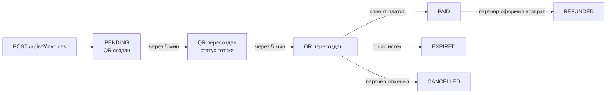

## За что отвечает API

API позволяет создавать счета на оплату, получать актуальные курсы валют, управлять клиентами, KYC-сессиями и читать аналитику. Создание/изменение **вебхуков и тарифов** — только через [веб-кабинет](https://loveandpay.io/dashboard).

## Подготовка

<Steps>
  <Step title="Получите API-ключи">
    Войдите в [Профиль → API](https://loveandpay.io/dashboard/profile).

    - **API Key** (постоянный UUID) — основной идентификатор партнёра.
    - **Secret Key** — нажмите **«Сгенерировать секретный ключ»**. Показывается **один раз** при создании — сохраните в безопасное место.

    <Warning>
    Если потеряли Secret — сгенерируйте новый. Старый перестанет работать **сразу**, без grace-периода.
    </Warning>
  </Step>

  <Step title="Выберите версию API">
    | Версия | Аутентификация | Рекомендация |
    |---|---|---|
    | **API v2** | API Key + HMAC-SHA256 | ✅ Используйте для нового интегрирования |
    | API v1 | Только API Key | Только для legacy-проектов |

    [Документация v2 →](/api-reference/v2/introduction)
  </Step>

  <Step title="Создайте первый счёт">
    Минимальный запрос — сумма в рублях:

    ```bash cURL
    TIMESTAMP=$(date +%s%3N)
    METHOD="POST"
    PATH="/api/v2/invoices"
    BODY='{"amount":1500.50,"description":"Тестовый счёт"}'
    BODY_HASH=$(echo -n "$BODY" | sha256sum | cut -d' ' -f1)
    MESSAGE="${METHOD}${PATH}${TIMESTAMP}${BODY_HASH}"
    SIGNATURE=$(echo -n "$MESSAGE" | openssl dgst -sha256 -hmac "$SECRET_KEY" | cut -d' ' -f2)

    curl -X POST "https://loveandpay.io${PATH}" \
      -H "Content-Type: application/json" \
      -H "x-api-key: $API_KEY" \
      -H "x-timestamp: $TIMESTAMP" \
      -H "x-signature: $SIGNATURE" \
      -d "$BODY"
    ```

    Ответ:

    ```json
    {
      "success": true,
      "invoice": {
        "id": "uuid",
        "invoiceNumber": "INV-260520-0001",
        "amount": 150050,
        "status": "PENDING",
        "qrCodeBase64": "data:image/png;base64,...",
        "qrCodePayload": "https://qr.nspk.ru/...",
        "paymentLink": "https://loveandpay.io/pay/INV-260520-0001",
        "expiresAt": "2026-05-20T15:00:00.000Z"
      }
    }
    ```

    <Note>
    **Суммы — в копейках** (`150050` = 1500.50 ₽).
    </Note>
  </Step>

  <Step title="Покажите клиенту QR или ссылку">
    Три способа доставки:

    - **QR-код**: `invoice.qrCodeBase64` (готовое PNG, base64 inline) — печатайте, шлите в чатах.
    - **Ссылка СБП**: `invoice.qrCodePayload` (https://qr.nspk.ru/…) — открывается в банковском приложении на телефоне.
    - **Платёжная страница**: `invoice.paymentLink` (https://loveandpay.io/pay/…) — удобный landing с QR, инструкцией и таймером.
  </Step>

  <Step title="Получайте уведомления об оплате">
    Зайдите в [Вебхуки](https://loveandpay.io/dashboard/webhooks) и подпишитесь на `invoice.paid`. На ваш URL придёт подписанный POST с данными счёта.

    Подробности — в [руководстве по вебхукам](/guides/webhooks).
  </Step>
</Steps>

## Жизненный цикл счёта



- **Счёт активен 1 час** с момента создания.
- **QR от банка живёт 5 минут**, потом мы автоматически генерируем новый — без вашего участия.
- На статусе PAID партнёр может оформить **возврат** (полный или частичный).

[Полный жизненный цикл →](/guides/invoice-lifecycle)

## Что дальше?

<CardGroup cols={2}>
  <Card title="Жизненный цикл счёта" icon="clock" href="/guides/invoice-lifecycle">
    QR, статусы, expiry, возвраты
  </Card>
  <Card title="Аутентификация v2" icon="key" href="/api-reference/v2/authentication">
    HMAC-SHA256, примеры на 4 языках
  </Card>
  <Card title="Webhooks через UI" icon="webhook" href="/guides/webhooks">
    Создание, тесты, retry-логика
  </Card>
  <Card title="Сотрудники и роли" icon="users" href="/guides/employees">
    PARTNER / EMPLOYEE / AGENT
  </Card>
  <Card title="KYC верификация" icon="shield-check" href="/guides/kyc-verification">
    Veriff / Didit, тарифы
  </Card>
  <Card title="FAQ" icon="circle-question" href="/guides/faq">
    Частые вопросы и подводные камни
  </Card>
</CardGroup>
